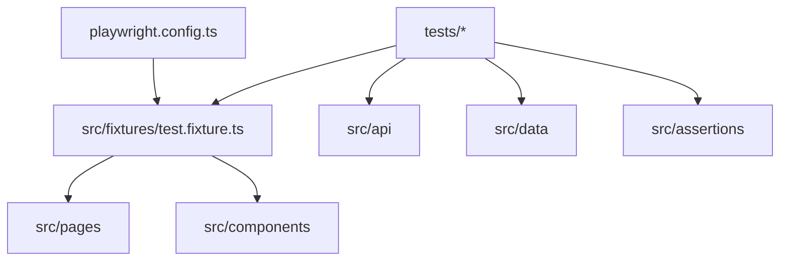

# Framework Architecture

## Layer Responsibilities
- `src/config`: environment and test project configuration.
- `src/fixtures`: dependency wiring for test ergonomics.
- `src/pages`: page-level business actions and assertions.
- `src/components`: reusable UI fragments.
- `src/api`: API clients used by API and hybrid tests.
- `src/data`: factories/builders for stable test data.
- `src/assertions`: custom assertions (a11y, visual helper extensions).

## Reliability Strategy
- Tag-driven project segmentation (`@api`, `@visual`, `@a11y`).
- Retries enabled with stricter artifact capture on failures.
- CI runs lint + typecheck + sharded test execution.

## Governance Artifacts
- Taxonomy and naming: `docs/test-taxonomy.md`
- Review checklist: `docs/review-template.md`
- Maintenance guide: `docs/maintenance-playbook.md`
- Test standards: `docs/testing-standards.md`
